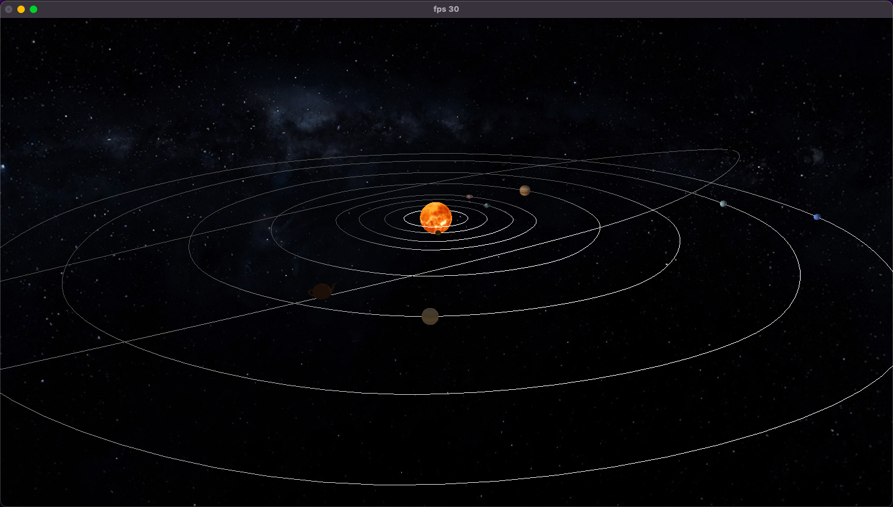

# 3D Engine using OpenGL and C++

## Overview

This project aims to develop a mini 3D engine using OpenGL and C++ to create a simulated solar system. The engine utilizes a scene graph-based approach to represent 3D scenes hierarchically. The system involves four phases, each building upon the previous one, to enhance functionality and realism progressively.

## Features

### Phase 1 - Graphical Primitives

- **Graphical Primitives:** Generate models such as Plane, Box, Sphere, and Cone using a standalone application.
- **File Generation:** Create model files with vertices information based on specified graphical primitives.
- **Configuration File:** Read an XML configuration file specifying which previously generated model files to load into the engine.

### Phase 2 - Geometric Transforms
- **Hierarchical Scenes:** Implement a scene graph with nodes representing geometric transforms (translate, rotate, scale) and models.
- **Configuration XML:** Define scenes hierarchically using XML, inheriting transforms from parent nodes to child nodes.
- **Static Solar System:** Create a static model of the solar system with a hierarchy of sun, planets, and moons.

### Phase 3 - Curves, Cubic Surfaces, and VBOs
- **Bezier Patches:** Extend the generator application to create models based on Bezier patches.
- **Geometric Transforms Extension:** Introduce Catmull-Rom cubic curves for translation with time-dependent transformations.
- **Dynamic Solar System:** Build a dynamic solar system with a comet trajectory defined using Catmull-Rom curves.
- **VBO Rendering:** Draw models using Vertex Buffer Objects (VBOs) for improved performance.

### Phase 4 - Normals and Texture Coordinates
- **Texture and Lighting:** Generate texture coordinates and normals for each vertex.
- **Lighting Functionality:** Activate lighting and texturing functionalities in the 3D engine.
- **Extended XML:** Define light sources and color components in the XML file.
- **Animated Solar System:** Showcase an animated solar system with texturing and lighting effects.

### Tools and Technologies
- **Language:** C++
- **Graphics Library:** OpenGL
- **XML Parsing:** Utilize third-party libraries like tinyXML for efficient XML file reading.

### Demo Scenes
- Phase 1: Display each graphical primitive individually.
- Phase 2: Static model of the solar system.
- Phase 3: Dynamic solar system with a comet trajectory.
- Phase 4: Animated solar system with texturing and lighting effects.

### Conclusion
This 3D engine project provides a comprehensive learning experience in graphics programming, scene graph management, and incorporating advanced features like Bezier patches, Catmull-Rom curves, VBOs, and lighting effects. The evolving complexity across phases ensures a gradual and structured learning curve for the students.

